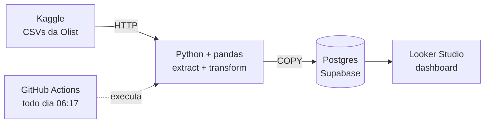

# Painel de Vendas Automático para E-commerce

Pipeline de dados que baixa, trata e carrega as vendas de uma loja online num banco Postgres
todos os dias, alimentando um dashboard no Looker Studio que está sempre atualizado.

**[Abrir o painel](https://datastudio.google.com/reporting/bc6956ba-3fbe-4476-985d-44c6d49b4193)**

## O problema

Uma loja online extrai as vendas do sistema todo dia, cola numa planilha e monta o relatório
à mão. O processo toma tempo, depende de uma pessoa lembrar de fazer e está sujeito a erro de
cópia.

## A solução

Um processo ETL (extração, transformação e carga) que roda sozinho, sem ninguém ligar o computador:



1. **Extract:** baixa o dataset público da Olist via HTTP quando os CSVs não estão no disco.
2. **Transform:** junta pedidos, itens, clientes e produtos com pandas e aplica as regras de
   negócio (período, cancelamentos, nomes de categoria).
3. **Load:** substitui o conteúdo das tabelas no Postgres numa única transação.
4. **Agendamento:** o GitHub Actions roda os testes e, se passarem, executa o pipeline todo dia.
5. **Dashboard:** o Looker Studio lê o banco com um usuário só de leitura.

## O painel

- **Indicadores:** faturamento, pedidos, ticket médio e pedidos cancelados
- **Faturamento mensal:** evolução de jan/2017 a ago/2018, com o pico da Black Friday de 2017
- **Top 10 estados** e **top 10 categorias**
- **Filtros** de período e estado que se aplicam a todos os gráficos

## Definições das métricas

| Métrica | Definição |
|---|---|
| Faturamento | Soma de `price + freight_value` dos itens, sem pedidos cancelados |
| Pedidos | Número de pedidos distintos, sem cancelados |
| Ticket médio | Faturamento ÷ pedidos (calculado sobre os totais, não como média das linhas) |
| Cancelados | Pedidos com status `canceled` ou `unavailable` |

## Decisões tomadas

- **Faturamento a partir dos itens, não dos pagamentos.** Os pagamentos incluem juros de
  parcelamento e não podem ser abertos por categoria. Em 99,7% dos pedidos os dois valores batem
  centavo a centavo.
- **Duas tabelas, cada uma num grão:** `fact_orders` (uma linha por pedido) e `fact_order_items`
  (uma linha por item). Juntar itens e pagamentos direto inflaria o faturamento de R$ 16,0 mi para
  R$ 20,3 mi; separar os grãos evita a contagem dupla.
- **Recorte de jan/2017 a ago/2018.** As pontas da base são incompletas (2016 tem poucos pedidos
  e set/out de 2018 quase só cancelamentos).
- **Pedidos sem itens descartados** (775, quase todos indisponíveis ou cancelados, sem valor).
- **Categorias em português**, com um dicionário de nomes legíveis ("Cama, Mesa e Banho").
- **Carga idempotente:** `TRUNCATE` + `COPY` dentro de uma transação. Rodar duas vezes dá o mesmo
  resultado, e uma falha no meio não deixa o banco pela metade.
- **Segurança:** credenciais só em variáveis de ambiente (`.env` local e *secret* no GitHub); a API
  REST pública do Supabase está desativada; o dashboard usa um usuário que só tem permissão de leitura.

## Stack

Python 3.12 · uv · pandas · psycopg · PostgreSQL (Supabase) · GitHub Actions · Looker Studio · pytest

## Como rodar localmente

Pré-requisitos: [uv](https://docs.astral.sh/uv/) e um banco Postgres (o projeto usa o plano
gratuito do Supabase).

```bash
# 1. Instalar dependências
uv sync

# 2. Configurar a conexão com o banco
cp .env.example .env   # e preencha DATABASE_URL

# 3. Rodar os testes
uv run pytest

# 4. Rodar o pipeline completo (baixa os dados se precisar, trata e carrega)
uv run --env-file .env painel-vendas-ecommerce
```

O pipeline também salva as tabelas tratadas em `data/processed/` como CSV, para conferência.

## Estrutura

```
src/painel_vendas_ecommerce/
├── config.py       # caminhos e regras de negócio (período, status cancelados)
├── extract.py      # download do dataset e leitura dos CSVs
├── transform.py    # montagem das tabelas fact_orders e fact_order_items
├── categories.py   # nomes de exibição das categorias em português
├── load.py         # carga no Postgres (TRUNCATE + COPY numa transação)
├── schema.sql      # estrutura das tabelas no schema painel
└── pipeline.py     # orquestra extract → transform → load
tests/              # 26 testes com pytest, sem depender de rede nem de banco
.github/workflows/  # agendamento diário no GitHub Actions
```

## Limitações

- O dataset da Olist é **histórico** (2016–2018) e não muda. A carga diária recarrega sempre os
  mesmos números: o objetivo do projeto é demonstrar a automação, que funcionaria igual com uma
  fonte que recebe vendas novas todo dia.
- O download sem login do Kaggle não é uma API oficial garantida. Se passar a exigir
  autenticação, basta adicionar uma chave do Kaggle como *secret*.

## Dados

[Brazilian E-Commerce Public Dataset by Olist](https://www.kaggle.com/datasets/olistbr/brazilian-ecommerce),
publicado no Kaggle sob licença CC BY-NC-SA 4.0. Dados públicos e anonimizados.
